REGEX

-did in anaconda 
-	Had the same problem as nadia and mychelle
-	Followed the instructions of opening it in the command prompt 
-	I did search and find at the same time when I was doing the coding
-	Then I relized I could copy and paste I forgot for a bit 
-	sublime when trying to get rid of empty lines it makes it have more
-	I did the fin ^\n and use the empty replace button 
-	https://stackoverflow.com/questions/12008986/sublime-text-2-how-to-delete-blank-empty-lines#comment41973082_12009505

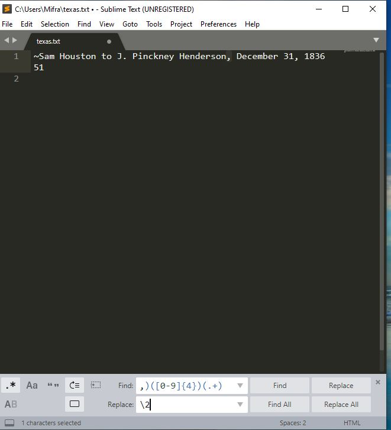
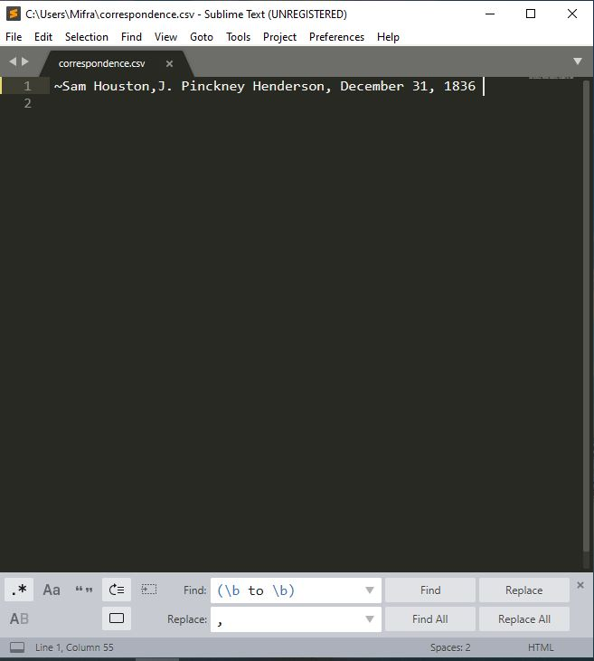

Open Refine

-I coult not openit at first
-Had to dowlaod java
-Then after trying to open it it worked when I extracted the files
-It was missing one column, I had to add one extra
https://guides.library.illinois.edu/openrefine/splitting
-I did not select the contents numbers when doing merge
-There was 3 final columns … like sidxi 
-Then I found this video and realized where I made my mistake https://www.youtube.com/watch?v=UD-VOjXZN4k&list=PLw4wN8PcDj_CcydCNwqUUHWZCIkA3obZC&index=10
-I forgot to uncheck the date 

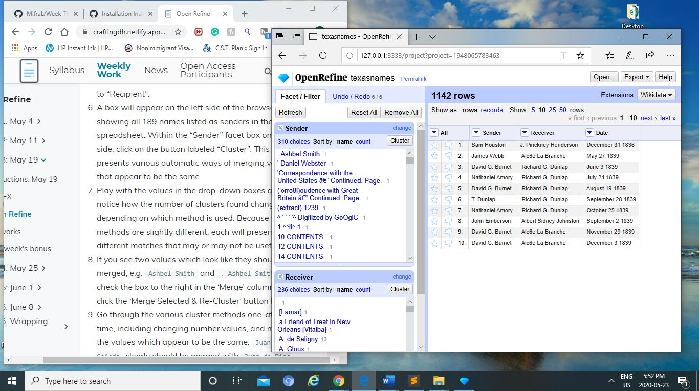
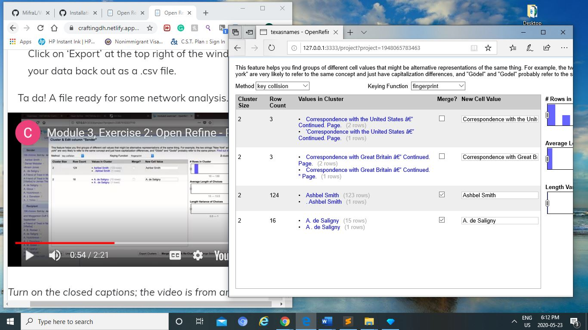
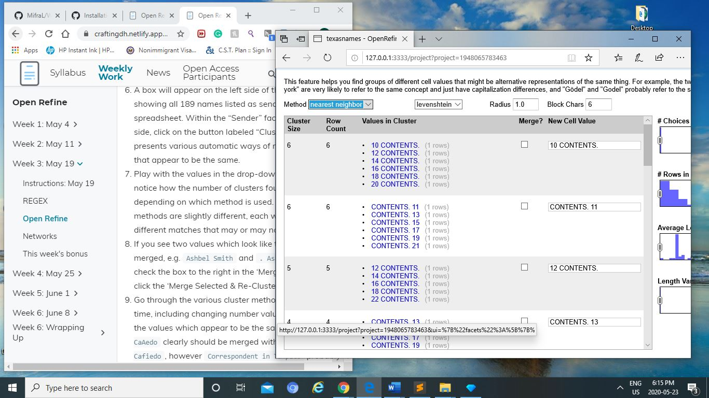

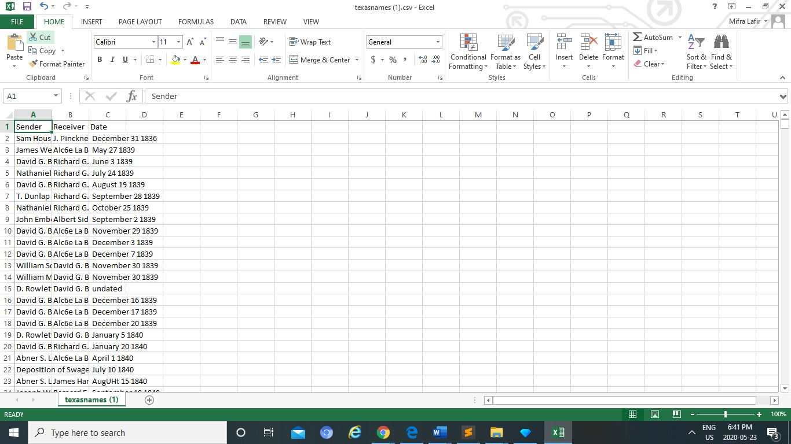

Network~Palladio

-I saved the prof’s file and then used it got an error like nadia, Kieran h, myshelle, zoe, … 
-So I did it on palladio through following the instructions by the prof

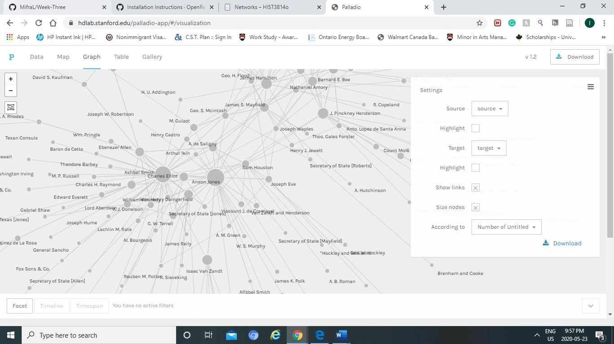
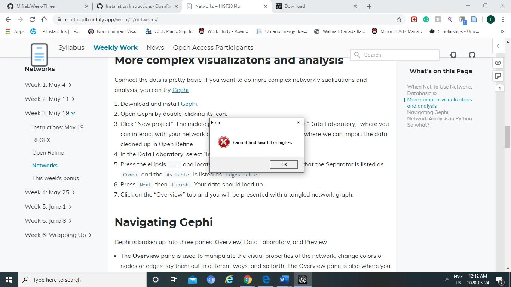

Gephi

-It took me awhile to download it , I did not have the right java
And after 
-When I opened, I followed the steps without opening texascorrespondence 

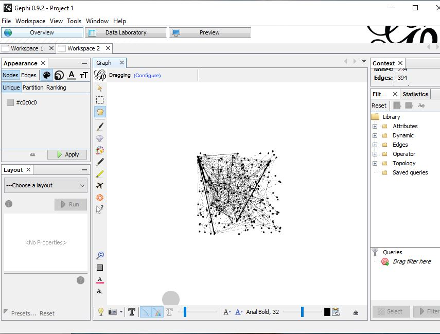
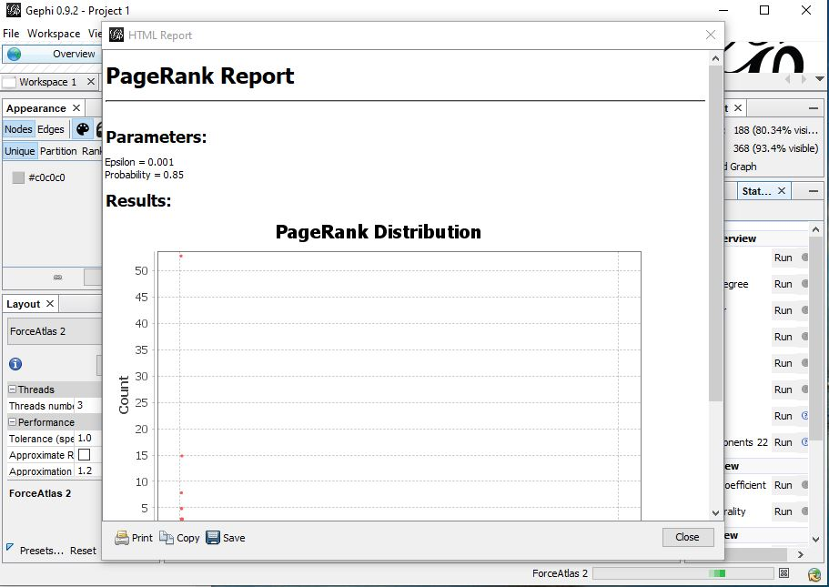

Bonus... not finished

- Set it as directory and it worked
-	I had only downloaded it prior 

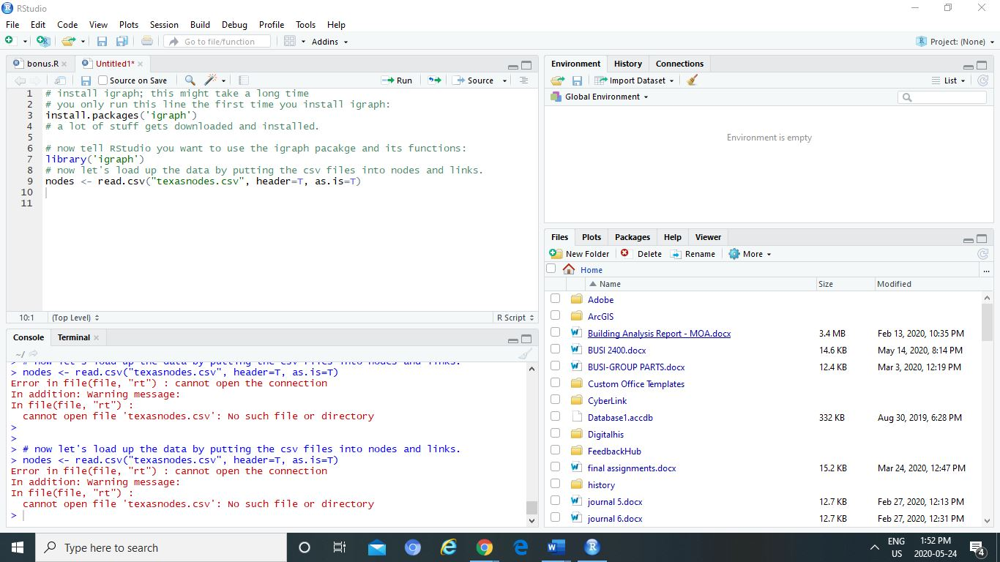
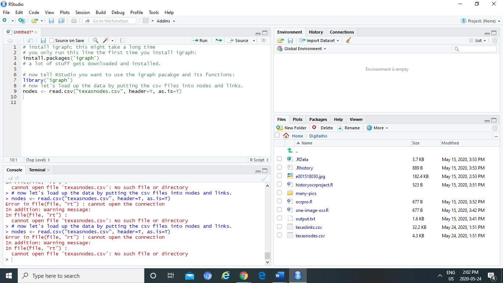

