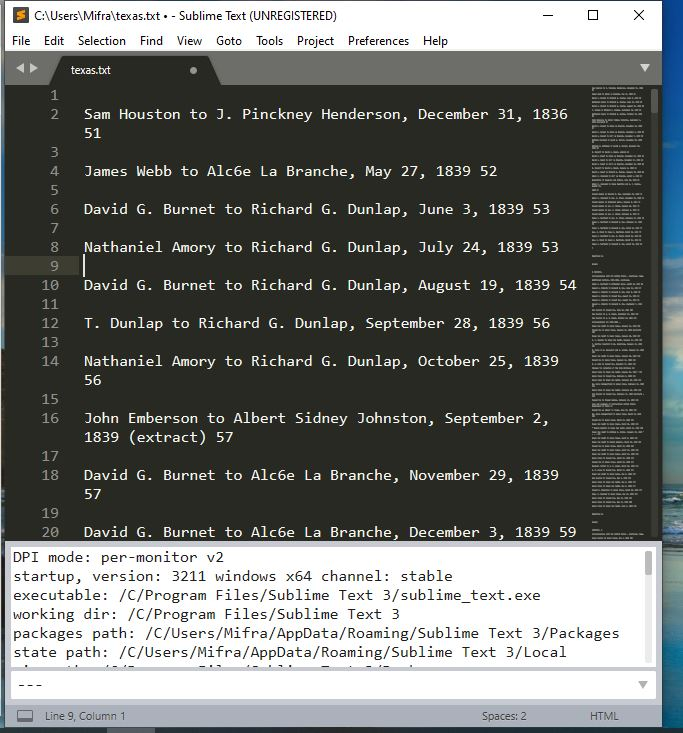
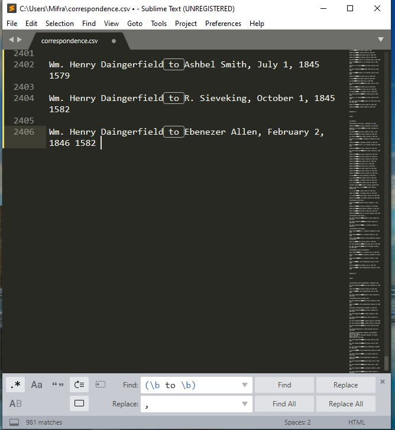
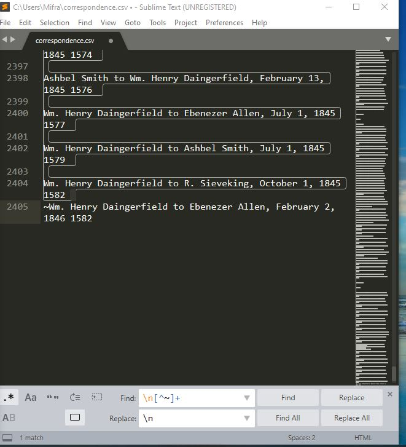
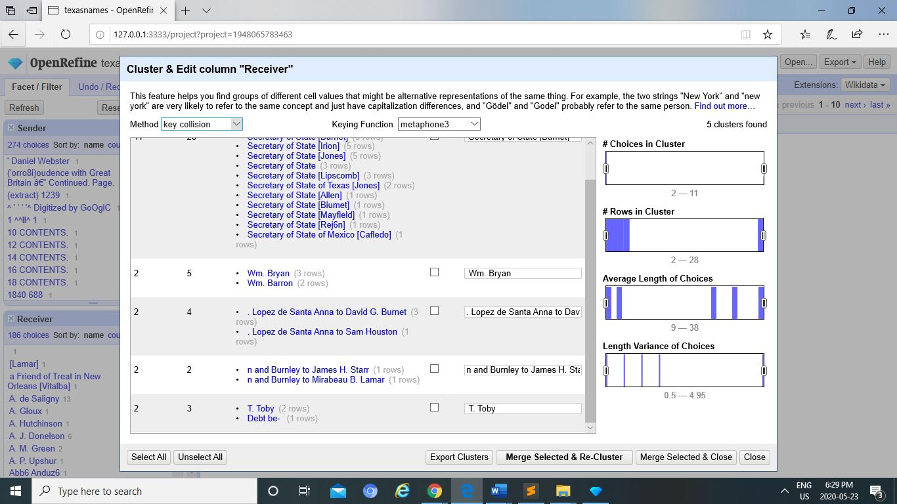
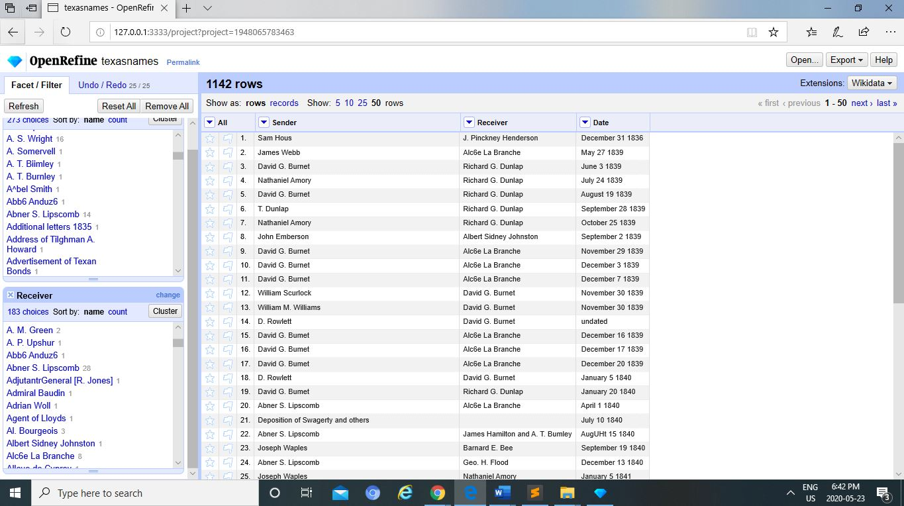
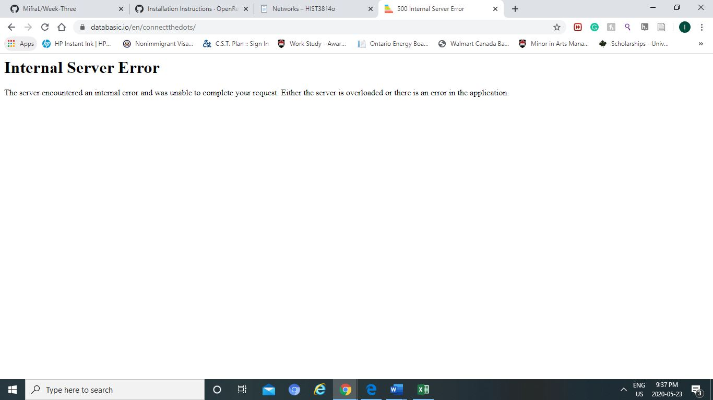
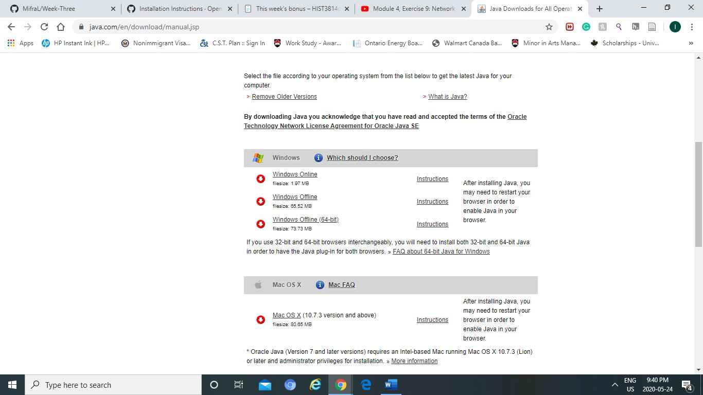
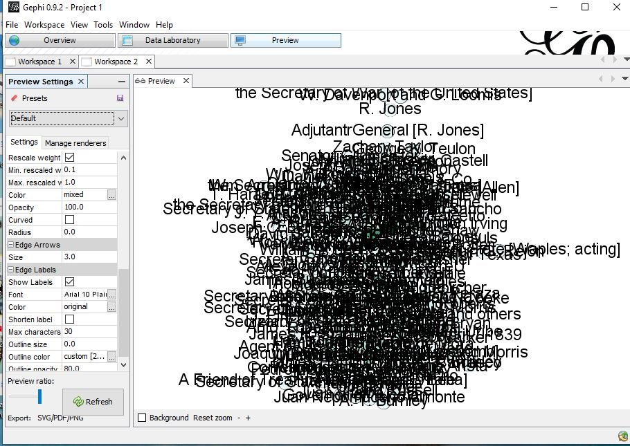
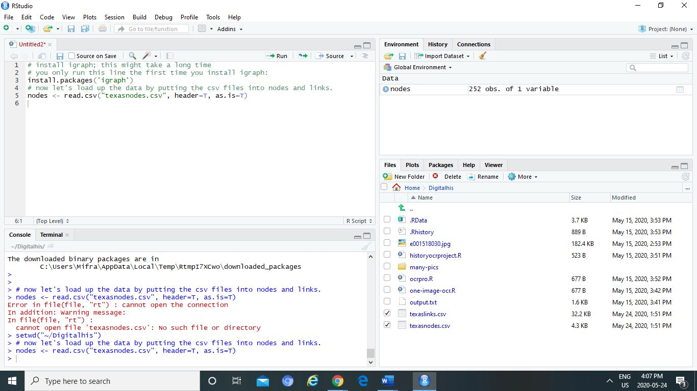
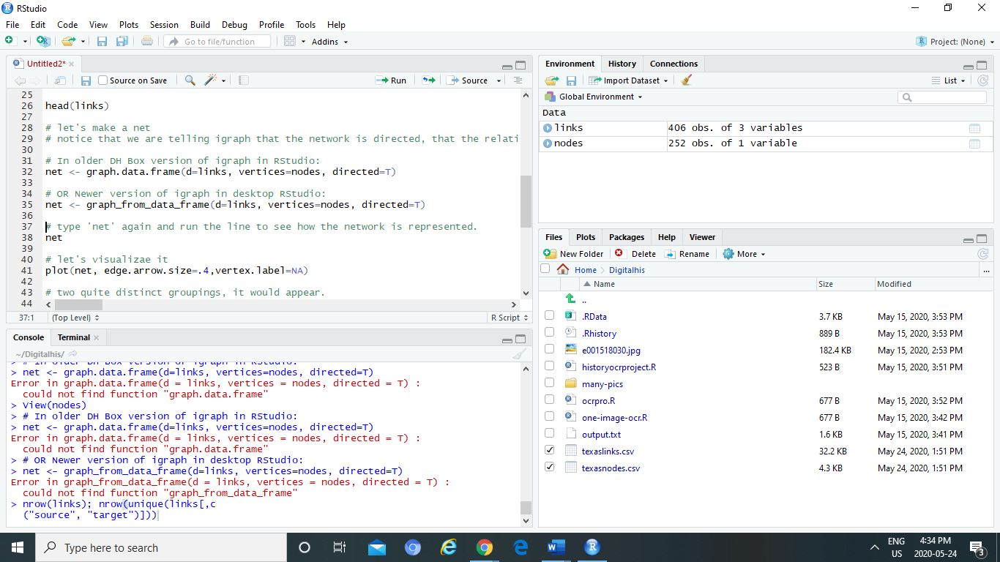

REGEX

- the second step where the texas file had to be downloaded did not work, it was not processing the command  
-	Had the same problem as nadia and mychelle and followed their tips which was to use the computer's command prompt rather than the anaconda command powershellprompt
-	Followed the instructions of opening it in the command prompt 
-	Then it did not work because I did the search and replace at the same time when I was doing the coding so after than I did it one after the other
- it was working fine but I had a lot of space between the lines and when I tried to get rid of it, it would add even more lines
-	I did the fin ^\n and use the empty replace button according to the tip from https://stackoverflow.com/questions/12008986/sublime-text-2-how-to-delete-blank-empty-lines#comment41973082_12009505
- but it was not working so after trying a few things, I did the same command after selecting everything in the prompt and it finally worked. 

Open Refine

-I coult not open it at first. The site was not working for me so I had to dowlaod java... and after that I tried extracting the files.
- It still was not opening so I had to open the program inside the folder and extract that and then cancel it because I already extracted and it somehow worked... It opened on my internet explorer as I had dowloaded Java using that platform. 
-When I downloaded my file, it was missing one column, I had to add one extra according to https://guides.library.illinois.edu/openrefine/splitting
-There were some extra lines that did included random content numbers, I did not select the contents numbers when doing merge with similar topics
- When I exported the file, it was saved as 3 final columns similar to sidxi. He gave some tips but it did not work.  
- So for the network, I decided to use the prof's file 
After having done all the exercises, I found where my mistake was through this video
@https://www.youtube.com/watch?v=UD-VOjXZN4k&list=PLw4wN8PcDj_CcydCNwqUUHWZCIkA3obZC&index=10
-I had not uncheck the date column when I was exporting my file

Network~Palladio

- I tried the Databasic.io, it was not working. The page had an error message like most of my classmates (nadia, Kieran h, myshelle, zoe, … )
-So I did it on palladio by following the instructions of the prof

Gephi

- It took me awhile to download it , so I spent a whole day trying to dowload the program and thinking of what could be wrong and I realized the version of Java that I had was not the right one.
- Then I could open the program after I haad dowloaded the correct 64-bit Java for windows
-When I first opened the application, I followed the steps without opening texascorrespondence. It didn't work.
- After my realization, everything else was smooth.

Bonus... not finished

- The links were saved but the program stated that it could not be found
- Then I realized I had to set it as directory and it worked, finally.
-	But then I got stuck at the line 39 where I had to create the igraph both the new and old versions weren't working

